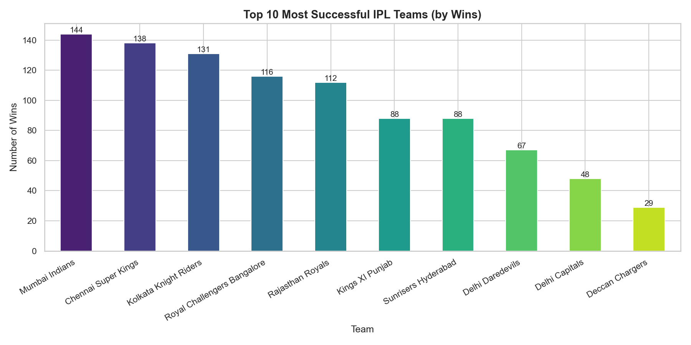
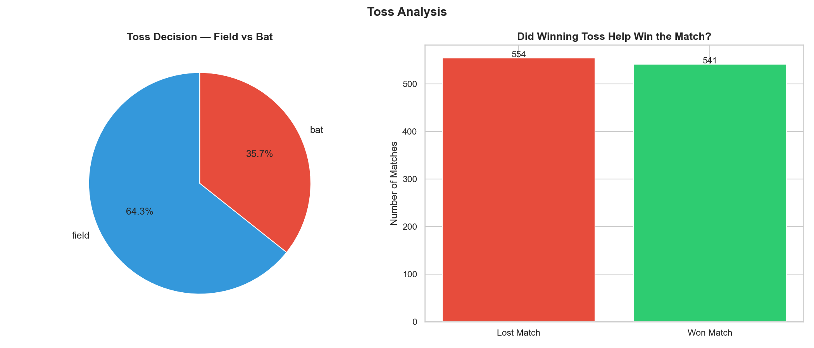
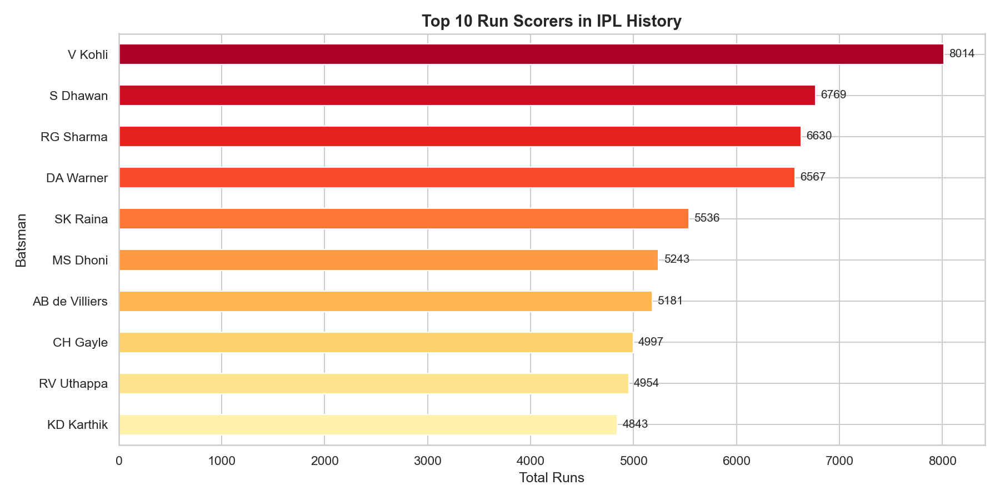
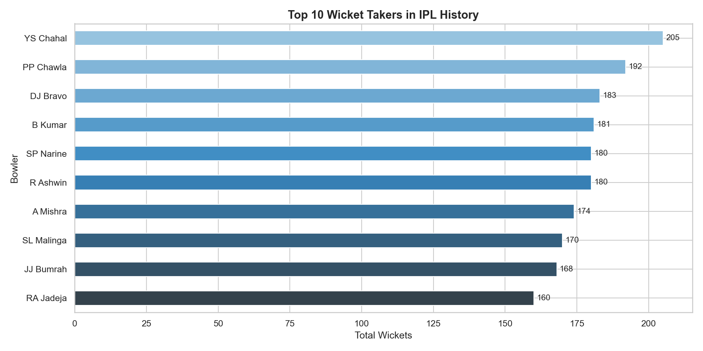
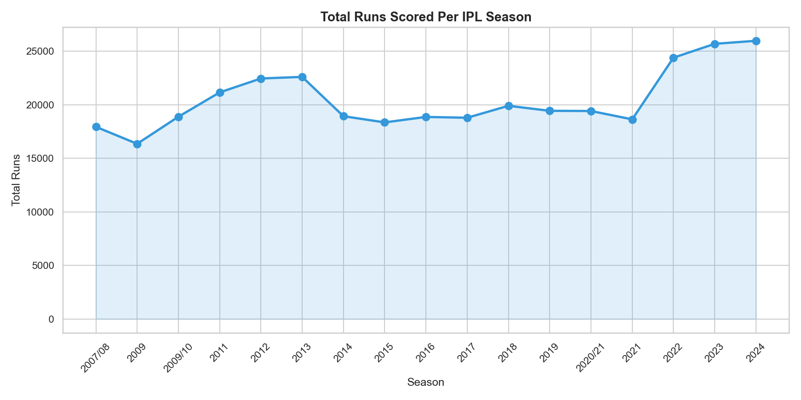
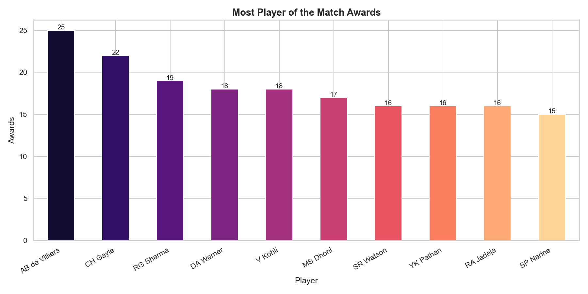

# IPL Cricket Analysis (2008–2020)

Exploratory data analysis of the Indian Premier League covering 1,095 matches
and 260,920 ball-by-ball deliveries across 13 seasons.

## Dataset
[IPL Complete Dataset 2008–2020 — Kaggle](https://www.kaggle.com/datasets/patrickb1912/ipl-complete-dataset-20082020)
- `matches.csv` — 1,095 matches, 20 features
- `deliveries.csv` — 260,920 deliveries, 17 features

## Key Findings
- Mumbai Indians are the most successful team with the highest wins across all seasons
- Fielding first is the preferred toss decision — majority of captains choose to field
- Winning the toss has minimal impact on match outcome
- Virat Kohli is the all-time leading run scorer by a significant margin
- Total runs per season have increased — batting has become more aggressive over the years
- AB de Villiers dominates Player of the Match awards

## Visualizations

### Most Successful Teams


### Toss Analysis


### Top 10 Run Scorers


### Top 10 Wicket Takers


### Runs Per Season


### Player of the Match Awards


## Project Structure
ipl-analysis/

├── ipl_analysis.ipynb       # main analysis notebook

├── matches.csv              # match-level data

├── deliveries.csv           # ball-by-ball data

├── team_wins.png

├── toss_analysis.png

├── top_batsmen.png

├── top_bowlers.png

├── runs_per_season.png

├── player_of_match.png

├── README.md

└── requirements.txt

## Libraries Used
| Library | Purpose |
|---------|---------|
| pandas | data loading, merging, aggregation |
| numpy | numerical operations |
| matplotlib | base plotting |
| seaborn | statistical visualizations |

## How to Run
```bash
pip install -r requirements.txt
jupyter notebook ipl_analysis.ipynb
```
